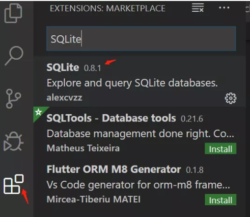
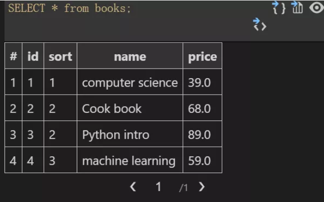

## 目录

[TOC]

### 十一、一步一步掌握Flask web开发

#### 1 Flask版 hello world

Flask是Python轻量级web框架，容易上手，被广大Python开发者所喜爱。

今天我们先从hello world开始，一步一步掌握Flask web开发。例子君是Flask框架的小白，接下来与读者朋友们，一起学习这个对我而言的新框架，大家多多指导。

首先`pip install Flask`,安装Flask，然后import Flask，同时创建一个 `app`
```python
from flask import Flask

App = Flask(__name__)
```

写一个index页的入口函数，返回hello world.

通过装饰器：App.route('/')创建index页的路由或地址，一个`/`表示index页，也就是主页。

```python
@App.route('/')
def index():
    return "hello world"
```

调用 `index`函数:
```python
if __name__ == "__main__":
    App.run(debug=True)
```

然后启动，会在console下看到如下启动信息，表明`服务启动成功`。
```python
* Debug mode: on
 * Restarting with stat
 * Debugger is active!
 * Debugger PIN: 663-788-611
 * Running on http://127.0.0.1:5000/ (Press CTRL+C to quit)
```

 接下来，打开一个网页，相当于启动客户端，并在Url栏中输入：`http://127.0.0.1:5000/`，看到页面上答应出`hello world`，证明服务访问成功。

 同时在服务端后台看到如下信息，表示处理一次来自客户端的`get`请求。
 ```python
 27.0.0.1 - - [03/Feb/2020 21:26:50] "GET / HTTP/1.1" 200 -
 ```

 以上就是flask的hello world 版

#### 2 Flask之数据入库操作

数据持久化就是将数据写入到数据库存储的过程。

本例子使用`sqlite3`数据库。

1)导入`sqlite3`，未安装前使用命令`pip install sqlite3`

创建一个`py`文件：`sqlite3_started.py`，并写下第一行代码：
```python
import sqlite3
```
2)手动创建一个数据库实例`db`, 命名`test.db`

3)创建与数据库实例`test.db`的连接:
```python
conn = sqlite3.connect("test.db")
```

4)拿到连接`conn`的cursor
```python
c = conn.cursor()
```

5)创建第一张表`books`

共有四个字段：`id`,`sort`,`name`,`price`，类型分别为：`int`,`int`,`text`,`real`. 其中`id`为`primary key`. 主键的取值必须是唯一的(`unique`)，否则会报错。


```python
c.execute('''CREATE TABLE books
      (id int primary key,
       sort int,
       name text,
       price real)''')
```
第一次执行上面语句，表`books`创建完成。当再次执行时，就会报`重复建表`的错误。需要优化脚本，检查表是否存在`IF NOT EXISTS books`，不存在再创建：
```python
c.execute('''CREATE TABLE IF NOT EXISTS books
      (id int primary key,
       sort int,
       name text,
       price real)''')
```

6)插入一行记录

共为4个字段赋值

```python
c.execute('''INSERT INTO books VALUES
       (1, 
       1, 
       'computer science',
       39.0)''')
```

7)一次插入多行记录

先创建一个list:`books`，使用`executemany`一次插入多行。
```python
books = [(2, 2, 'Cook book', 68),
         (3, 2, 'Python intro', 89),
         (4, 3, 'machine learning', 59),
         ]


c.executemany('INSERT INTO books VALUES (?, ?, ?, ?)', books)
```

8)提交

提交后才会真正生效，写入到数据库

```python
conn.commit()
```

9)关闭期初建立的连接conn

务必记住手动关闭，否则会出现内存泄漏
```python
conn.close()
print('Done')
```

10)查看结果
例子君使用`vs code`，在扩展库中选择：`SQLite`安装。



新建一个`sq`文件：`a.sql`，内容如下：

```sql
SELECT * from books 
```
右键`run query`，得到表`books`插入的4行记录可视化图：



以上十步就是sqlite3写入数据库的主要步骤，作为Flask系列的第二篇，为后面的前端讲解打下基础。

#### 3 Flask各层调用关系

这篇介绍Flask和B/S模式，即浏览器/服务器模式，是接下来快速理解Flask代码的关键理论篇：**理解Views、models和渲染模板层的调用关系**。

1) 发出请求

当我们在浏览器地址栏中输入某个地址，按回车后，完成第一步。

2) 视图层 views接收1)步发出的请求，Flask中使用解释器的方式处理这个求情，实例代码如下，它通常涉及到调用models层和模板文件层

```python
@main_blue.route('/', methods=['GET', 'POST'])
def index():
    form = TestForm()
    print('test')
```

3) models层会负责创建数据模型，执行CRUD操作

4) 模板文件层处理html模板

5) 组合后返回html

6) models层和html模板组合后返回给views层

7）最后views层响应并渲染到浏览器页面，我们就能看到请求的页面。

完整过程图如下所示：


读者朋友们，如果你和例子君一样都是初学Flask编程，需要好好理解上面的过程。理解这些对于接下来的编程会有一定的理论指导，方向性指导价值。


#### 4 Flask之表单操作

**1 开篇**

先说一些关于Flask的基本知识，现在不熟悉它们，并不会影响对本篇的理解和掌握。

Flask是一个基于Python开发，依赖`jinja2`模板和`Werkzeug` WSGI服务的一个微型框架。

`Werkzeug`用来处理Socket服务，其在Flask中被用于接受和处理http请求；`Jinja2`被用来对模板进行处理，将`模板`和`数据`进行渲染，返回给用户的浏览器。

这到这些，对于理解后面调试出现的两个问题会有帮助，不过不熟悉仍然没有关系。

**2 基本表单**

首先导入所需模块：

```python
from wtforms import StringField,PasswordField, BooleanField, SubmitField
from flask_wtf import FlaskForm
```

`wtforms`和`flask_wtf`是flask创建web表单类常用的包。

具体创建表单类的方法如下，登入表单`LoginForm`继承自`FlaskForm`.

分别创建`StringFiled`实例用户名输入框`user_name`，密码框`password`，勾选框`remember_me`和提交按钮`submit`.

```python
class LoginForm(FlaskForm):
    user_name = StringField()
    password = PasswordField()
    remember_me = BooleanField(label='记住我')
    submit = SubmitField('Submit')
```

至此表单类对象创建完毕

**3 html模板**

使用`Bootstrap`. 它是由Twitter推出的一个用于前端开发的开源工具包，给予HTML、CSS、JavaScriot，提供简洁、直观、强悍的前端开发框架，是目前最受环境的前端框架。

`flak_bootstrap`提供使用的接口。方法如下，首先`pip install bootstrap`，然后创建一个实例`bootstrap`.

```python
from flask_bootstrap import Bootstrap
bootstrap = Bootstrap()
```

然后创建`index.html`文件，第一行导入创建的Bootstrap实例`bootstrap`：

```python

```

再创建第2节中创建的`LoginForm`实例`form`，调用渲染模板方法，参数`form`赋值为实例`form`:

```python
from flask import render_template
form = LoginForm()
render_template('index.html', form=form)
```

再在index.html输入以下代码，`{{ wtf.quick_form(form) }}`将实例`form`渲染到html页面中。

```python
<div class="container">
    <h3>系统登入</h3>
    <div class="col-md-4">
        {{ wtf.quick_form(form) }}
    </div>
</div>
```

**4 index页面路由**

`flask_wtf`创建的form，封装方法`validate_on_submit`，具有表单验证功能。

```python
@app.route('/', methods=['GET', 'POST'])
def index():
    form = LoginForm()
    if form.validate_on_submit():
        print(form.data['user_name'])
        return redirect(url_for('print_success'))

    return render_template('index.html', form=form)
```

验证通过跳转到`print_success`方法终端点：

```python
@app.route('/success')
def print_success():
    return"表单验证通过"
```

**5 完整代码**

共有两个文件：一个py，一个html:

```python
from flask import Flask
from flask import render_template, redirect, url_for
from wtforms import StringField,PasswordField, BooleanField, SubmitField
from flask_wtf import FlaskForm
from flask_bootstrap import Bootstrap

bootstrap = Bootstrap()

app = Flask(__name__)
app.config['SECRET_KEY']  = "hard_to_guess_secret_key$$#@"

bootstrap.init_app(app)

@app.route('/', methods=['GET', 'POST'])
def index():
    form = LoginForm()
    if form.validate_on_submit():
        print(form.data['user_name'])
        return redirect(url_for('print_success'))

    return render_template('index.html', form=form)

@app.route('/success')
def print_success():
    return"表单验证通过"


class LoginForm(FlaskForm):
    user_name = StringField()
    password = PasswordField()
    remember_me = BooleanField(label='记住我')
    submit = SubmitField('Submit')

if __name__ == "__main__":
    app.run(debug=True)
```

html代码：

```python

<div class="container">
    <h3>系统登入</h3>
    <div class="col-md-4">
        {{ wtf.quick_form(form) }}
    </div>
</div>
```

启动后，控制台显示如下：


然后网页中输入127.0.0.1:5000,网页显示：


**6 两个错误**

例子君也是Flask新手，在调试过程中，遇到下面两个错误。

**1) CSRF需要配置密码**


遇到这个错误，解决的方法就是配置一个密码。具体对应到第5节完整代码部分中的此行：

```
app.config['SECRET_KEY']  = "hard_to_guess_secret_key$$#@"
```

**2) index.html未找到异常**


出现这个错误的原因不是因为index.html的物理路径有问题，而是我们需要创建一个文件夹并命名为：`templates`，然后把index.html移动到此文件夹下。

#### 5 Flask之Pyecharts绘图

Flask系列已推送4篇，今天结合Flask和Pyecharts，做出一些好玩的东西。

首先，参考官方文档导入所需包：

```python
from flask import Flask
from jinja2 import Markup, Environment, FileSystemLoader
from pyecharts.globals import CurrentConfig
```

配置环境，下面这行代码，告诉`jinja2`我的html模板位于哪个文件目录：

```
# 关于 CurrentConfig，可参考 [基本使用-全局变量]
CurrentConfig.GLOBAL_ENV = Environment(loader=FileSystemLoader("./templates"))
```

如果此处配置的有问题，会弹出下面的异常：

```
jinja2.exceptions.TemplateNotFound: index.html
```

下面两行代码是Flask的常规操作：

```python
app = Flask(__name__, static_folder="templates")
app.config['SECRET_KEY']  = "hard_to_guess_secret_key$$#@"
```

下面该pyecharts登台，还是一顿导包：
```python
from pyecharts.charts import Bar
from pyecharts.faker import Faker
import pyecharts.options as opts
from pyecharts.commons.utils import JsCode
from pyecharts.globals import ThemeType
```

创建一个基本的柱状图：
```python
def bar():
    c = (
        Bar(init_opts=opts.InitOpts(
            animation_opts=opts.AnimationOpts(
                animation_delay=500, animation_easing="cubicOut"
            ),
            theme=ThemeType.MACARONS))
        .add_xaxis(["草莓", "芒果", "葡萄", "雪梨", "西瓜", "柠檬", "车厘子"])
        .add_yaxis("销售量", Faker.values(), category_gap="50%", is_selected=True)
        .set_global_opts(title_opts=opts.TitleOpts(title="Bar-基本参数使用"), toolbox_opts=opts.ToolboxOpts(), datazoom_opts=opts.DataZoomOpts(),)

    )

    return c
```

下面是最重要的部分。pyecharts柱状图和flask的网页组装阶段。

```python
@app.route("/")
def index():
    c = bar()
    return c.render_embed(template_name='index.html')
```
组装的代码相当简单，普通的pyecharts渲染使用`c.render(filename.html)`, 而嵌入到指定网页`index.html`中，使用API:`render_embed`.

具体index.html上如何布局显示，就要写点html代码：
```html


<!DOCTYPE html>
<html>
<head>
    <meta charset="UTF-8">
    <title>{{ chart.page_title }}</title>
    {{ macro.render_chart_dependencies(chart) }}
</head>
<body>
    {{ macro.render_chart_content(chart) }}
</body>
</html>
```
为了让html代码尽可能的复用，Pyecharts开发团队太有心，专门抽象出一个宏文件`macro`. 这部分代码大家就不用修改了，直接copy即可。

为了保证本篇代码可复现，paster这个文件到这里：
```html

    <div id="{{ c.chart_id }}" class="chart-container" style="width:{{ c.width }}; height:{{ c.height }};"></div>
    <script>
        var chart_{{ c.chart_id }} = echarts.init(
            document.getElementById('{{ c.chart_id }}'), '{{ c.theme }}', {renderer: '{{ c.renderer }}'});
        
            {{ js }}
        
        var option_{{ c.chart_id }} = {{ c.json_contents }};
        chart_{{ c.chart_id }}.setOption(option_{{ c.chart_id }});
        
            var bmap = chart_{{ c.chart_id }}.getModel().getComponent('bmap').getBMap();
            
                
                    {{ fn }}
                
            
        
    </script>



    <script>
        require([{{ libraries | join(', ') }}], function(echarts) {
        
            
                var chart_{{ c.chart_id }} = echarts.init(
                    document.getElementById('{{ c.chart_id }}'), '{{ c.theme }}', {renderer: '{{ c.renderer }}'});
                
                    {{ js }}
                
                var option_{{ c.chart_id }} = {{ c.json_contents }};
                chart_{{ c.chart_id }}.setOption(option_{{ c.chart_id }});
                
                    var bmap = chart_{{ c.chart_id }}.getModel().getComponent('bmap').getBMap();
                    bmap.addControl(new BMap.MapTypeControl());
                
            
        
        });
    </script>



    
        <script type="text/javascript" src="{{ dep }}"></script>
    



    
        <link rel="stylesheet"  href="{{ dep }}">
    



    <div class="tab">
        
            <button class="tablinks" onclick="showChart(event, '{{ c.chart_id }}')">{{ c.tab_name }}</button>
        
    </div>



    <script>
        (function() {
            containers = document.getElementsByClassName("chart-container");
            if(containers.length > 0) {
                containers[0].style.display = "block";
            }
        })()

        function showChart(evt, chartID) {
            let containers = document.getElementsByClassName("chart-container");
            for (let i = 0; i < containers.length; i++) {
                containers[i].style.display = "none";
            }

            let tablinks = document.getElementsByClassName("tablinks");
            for (let i = 0; i < tablinks.length; i++) {
                tablinks[i].className = "tablinks";
            }

            document.getElementById(chartID).style.display = "block";
            evt.currentTarget.className += " active";
        }
    </script>



    <style>
        .tab {
            overflow: hidden;
            border: 1px solid #ccc;
            background-color: #f1f1f1;
        }

        .tab button {
            background-color: inherit;
            float: left;
            border: none;
            outline: none;
            cursor: pointer;
            padding: 12px 16px;
            transition: 0.3s;
        }

        .tab button:hover {
            background-color: #ddd;
        }

        .tab button.active {
            background-color: #ccc;
        }

        .chart-container {
            display: none;
            padding: 6px 12px;
            border-top: none;
        }
    </style>



    
        <style>
            .fl-table {
                margin: 20px;
                border-radius: 5px;
                font-size: 12px;
                border: none;
                border-collapse: collapse;
                max-width: 100%;
                white-space: nowrap;
                word-break: keep-all;
            }

            .fl-table th {
                text-align: left;
                font-size: 20px;
            }

            .fl-table tr {
                display: table-row;
                vertical-align: inherit;
                border-color: inherit;
            }

            .fl-table tr:hover td {
                background: #00d1b2;
                color: #F8F8F8;
            }

            .fl-table td, .fl-table th {
                border-style: none;
                border-top: 1px solid #dbdbdb;
                border-left: 1px solid #dbdbdb;
                border-bottom: 3px solid #dbdbdb;
                border-right: 1px solid #dbdbdb;
                padding: .5em .55em;
                font-size: 15px;
            }

            .fl-table td {
                border-style: none;
                font-size: 15px;
                vertical-align: center;
                border-bottom: 1px solid #dbdbdb;
                border-left: 1px solid #dbdbdb;
                border-right: 1px solid #dbdbdb;
                height: 30px;
            }

            .fl-table tr:nth-child(even) {
                background: #F8F8F8;
            }
        </style>
        <div id="{{ chart.chart_id }}" class="chart-container" style="">
            <p class="title" {{ chart.title_opts.title_style }}> {{ chart.title_opts.title }}</p>
            <p class="subtitle" {{ chart.title_opts.subtitle_style }}> {{ chart.title_opts.subtitle }}</p>
            {{ chart.html_content }}
        </div>
    
        <div id="{{ chart.chart_id }}" class="chart-container" style="">
            <p class="title" {{ chart.title_opts.title_style }}> {{ chart.title_opts.title }}</p>
            <p class="subtitle" {{ chart.title_opts.subtitle_style }}> {{ chart.title_opts.subtitle }}</p>
            
        </div>
    


```

记得最后把这个文件名称为`macro`和`index.html`文件都统一放到`templates`文件夹下。

这样就可以调试了：
```python
if __name__ == "__main__":
    app.run(debug=True)
```


**附加**

再写一个展示页面，路由为`/bar2`:
```python
@app.route("/bar2")
def bar2():
    c = bar_border_radius()
    return c.render_embed(template_name='index.html')
```

函数bar_border_radius定义如下：
```python
def bar_border_radius():
    c = (
        Bar(init_opts=opts.InitOpts(
            animation_opts=opts.AnimationOpts(
                animation_delay=500, animation_easing="cubicOut"
            ),
            theme=ThemeType.MACARONS))
        .add_xaxis(["草莓", "芒果", "葡萄", "雪梨", "西瓜", "柠檬", "车厘子"])
        .add_yaxis("销售量", Faker.values(), category_gap="50%", is_selected=True)
        .set_series_opts(itemstyle_opts={
            "normal": {
                "color": JsCode("""new echarts.graphic.LinearGradient(0, 0, 0, 1, [{
                    offset: 0,
                    color: 'rgba(0, 244, 255, 1)'
                }, {
                    offset: 1,
                    color: 'rgba(0, 77, 167, 1)'
                }], false)"""),
                "barBorderRadius": [6, 6, 6, 6],
                "shadowColor": 'rgb(0, 160, 221)',
            }}, markpoint_opts=opts.MarkPointOpts(
                data=[
                    opts.MarkPointItem(type_="max", name="最大值"),
                    opts.MarkPointItem(type_="min", name="最小值"),
                ]
        ), markline_opts=opts.MarkLineOpts(
                data=[
                    opts.MarkLineItem(type_="min", name="最小值"),
                    opts.MarkLineItem(type_="max", name="最大值")
                ]
        ))
        .set_global_opts(title_opts=opts.TitleOpts(title="Bar-参数使用例子"), toolbox_opts=opts.ToolboxOpts(), yaxis_opts=opts.AxisOpts(position="right", name="Y轴"), datazoom_opts=opts.DataZoomOpts(),)

    )

    return c
```

这样又出现一个页面，演示如下：

